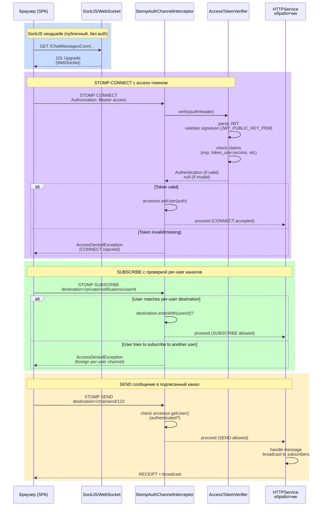

# HTTPService

`HTTPService` — фронтовый сервис мессенджера: отдаёт SPA-шеллы (Thymeleaf-страницы, которые дальше живут на JS), JSON API под `/api/**`, STOMP/WebSocket для живых обновлений, проксирует загрузку/отдачу картинок через MinIO и дергает Gemini API для AI-ассиста в чате. Данными чатов/сообщений не владеет — ходит за ними по gRPC в `MessegerParody`, за аутентификацией — в `AuthService`. Это же единственный сервис, который реально минтит пару access+refresh JWT (`TokensResolver`, приватный ключ только здесь) — подробности в `docs/security-flow.md`.

Технически сервис — гибрид MVC и WebFlux в одном процессе (`WebApplicationType.SERVLET`, см. `Main.java`): обычный Spring MVC поднят на `/`, а ручной WebFlux-роутер (`WebFluxConfig`, роуты `/chatlist`, `/chat`, `/createchat`, `/login`, `/register`) смонтирован отдельным сервлетом на `/reactive/*`. STOMP/SockJS живёт поверх MVC-инфраструктуры (`StompConfig`), `/AiAssist` — обычный MVC `@PostMapping`.

## Зона ответственности

- **SPA-шеллы + JSON API**: Thymeleaf-страницы, публичные для загрузки, но данные тянут через `/api/**` с `Authorization: Bearer` (`ApiController`, `WEBFLUX_Service`).
- **Аутентификация SPA**: единственный сервис, который минтит пару access+refresh JWT (`TokensResolver`); для `/api/**` доверяет заголовкам от ingress, но на STOMP CONNECT сам валидирует access-JWT (`AccessTokenVerifier`) — единственное место в этом сервисе, где JWT проверяется вручную, а не через ingress.
- **Картинки в MinIO**: загрузка аватара/картинки чата (`ImageStorageService`, `WEBFLUX_Service.Upload_image`) и их отдача (`GET /api/images/{*key}`).
- **AI-ассист чата** поверх Google Gemini API (`GeminiService`, `POST /AiAssist`).
- **STOMP/WebSocket**: живые обновления списка чатов, самого чата, статусов и картинок (`StompConfig`, `StompHandlers/*`).
- **Kafka**: продюсер `Messages`/`Images`, консюмер `Images`/`Events` — см. раздел «Kafka» ниже.

## SPA-аутентификация (кратко)

Полная схема — в [`docs/security-flow.md`](security-flow.md). Здесь только то, что специфично для этого сервиса:

- Access-JWT никогда не попадает в cookie — SPA держит его только в памяти браузера и шлёт как `Authorization: Bearer <access>`.
- `/api/**` (см. `Services/ApiController.java`) аутентифицируется `MvcJwtAuthFilter`: фильтр проверяет RSA-подпись access-JWT из `Authorization: Bearer` через `Utils/AccessTokenVerifier` и кладёт `UsernamePasswordAuthenticationToken` с principal из `sub` в `SecurityContextHolder`. Заголовки `X-User-ID`/`X-Authorities` от ingress при этом игнорируются — до beads 1fs личность бралась из них, и доверенными их делала только топология ingress. `auth_request` в `AuthService /jwtcheck` остаётся поверх и отвечает за ревокацию (жива ли refresh-сессия по `sid`). `MvcSecurityConfig` требует аутентификацию на все пути кроме явного `permitAll()`-списка (шеллы, статика, `/welcome`, `/authcallback` и т.п.) и для `/api/**` отдаёт голый 401 (не редирект), чтобы SPA сама делала refresh+retry.
- STOMP CONNECT — отдельный путь: SockJS-хендшейк не несёт HTTP-заголовков, поэтому ingress `auth_request` его не видит. `StompAuthChannelInterceptor` сам валидирует access-токен на команде `CONNECT` через `AccessTokenVerifier` (проверяет подпись по `JWT_PUBLIC_KEY_PEM`, кладёт `Authentication` в `accessor.setUser(...)`). Тот же интерцептор на `SUBSCRIBE` не даёт подписаться на чужой per-user канал (`/private/**`, `/mutual/chatlist/{change_chatpreview,list_update,notify}/**`).
- STOMP-эндпоинты (SockJS) регистрируются в `StompConfig`: `/ChatMessagesConn`, `/MutualChatNotificationConn`, `/GeneralChatDataUpdateConn`, `/MutualChatListNotificationConn`, `/ChatChangesHandleConn`, `/MutualImagesConn`, `/StatusUserConn`.

### Диаграмма STOMP-аутентификации



## MinIO-пайплайн картинок

Загрузка (регистрация с аватаром, создание чата с картинкой) идёт через `WEBFLUX_Service.Upload_image(FilePart file, String targetId, String targetType)`:

1. Собирает файл из `FilePart` целиком в память (`DataBufferUtils.join`; лимит multipart — 5MB, см. `application.yml`).
2. Строит ключ объекта `<targetType>/<targetId>/<uuid>.<ext>` (`targetType` — `"userimage"` при регистрации, `"chatimage"` при создании чата).
3. Кладёт объект в MinIO через `ImageStorageService.putObject(key, bytes, contentType)` — все блокирующие вызовы MinIO SDK (`MinioClient`) уходят на `Schedulers.boundedElastic()`; бакет (`MINIO_BUCKET`, по умолчанию `images`) создаётся идемпотентно перед первой записью (`ensureBucket`).
4. После успешной записи публикует в Kafka-топик `Images` через `KafkaProducer.sendImage(...)` JSON-контракт `{ "targetType": "...", "targetId": "...", "objectKey": "..." }` — это модель `ImageUploadDTO` (`targetType`, `targetId`, `objectKey`). Тот же контракт (без Base64, только ключ) читает консюмер в `MessegerParody`.

Отдача картинок наружу — `GET /api/images/{*key}` в `ApiController`. Маппинг с `{*key}` намеренно, т.к. ключ объекта содержит слэши (`targetType/targetId/uuid.ext`); контроллер сам стрипает ведущий `/`. Реализация — прокси-стриминг через `ImageStorageService.getObject(key)` (тоже на `boundedElastic`), отдаёт `byte[]` с `Content-Type` из MinIO и приватным `Cache-Control` на 30 дней (`CacheControl.maxAge(30, DAYS).cachePrivate()`); при ошибке — 404, без деталей наружу.

Конфигурация клиента MinIO — `MinioConfig` (бин `MinioClient`), эндпоинт/креды из `MINIO_ENDPOINT`/`MINIO_ACCESS_KEY`/`MINIO_SECRET_KEY`.

## AI-ассист (Gemini)

`POST /AiAssist` (`WEBFLUX_Service.aiAssistHandler`, multipart-поля `TargetUsername` и `chat_id`) устроен так:

1. Тянет полный контекст чата из Redis (`ChatContextService.getFullContext()`), группирует сообщения по пользователю.
2. Строит промпт (`GeminiService.BuildJsonPrompt`) — системная инструкция на русском (ответить дружелюбно от лица ассистента, упомянуть `@targetUsername`, не выдумывать участников) уходит отдельным полем `system_instruction`, каждое сообщение участника — свой content-turn с `role: user`.
3. Отправляет в Gemini API (`GeminiService.GetAssistantAnswer`, `POST https://generativelanguage.googleapis.com/v1beta/models/{GEMINI_MODEL}:generateContent`, авторизация заголовком `x-goog-api-key`) и возвращает текст ответа как `Mono<String>`.

Эндпоинт не под `/api/**`, а на стандартном MVC-диспетчере (метод аннотирован `@PostMapping`, а не роутится через `WebFluxConfig`), поэтому защищён общим правилом `MvcSecurityConfig` (`anyRequest().authenticated()`) — то есть тем же `MvcJwtAuthFilter` поверх подписи access-JWT, что и `/api/**`.

Авторизация — статический API-ключ (`GEMINI_API_KEY`), без OAuth/JWT-обмена (в отличие от прежней Yandex-интеграции — миграция описана в `docs/superpowers/specs/2026-07-29-yandex-to-gemini-migration-design.md`). Модель конфигурируется через `GEMINI_MODEL` (default `gemini-2.5-flash-lite`), используется и для чат-ассиста, и для анти-фрод скоринга (`aiSecurePredict`, structured JSON output через `responseSchema`).

Отсутствующий/пустой `GEMINI_API_KEY` — явный `IllegalStateException` при первом вызове, не тихий сбой.

## Kafka: producer/consumer в этом сервисе

`HTTPService` — единственный продюсер топиков `Images` и `Messages` (второй сейчас без единого активного консюмера — см. ниже); читает (консюмит) `Images` и `Events`.

**Producer** (`KafkaProducer`):
- `Messages` — при отправке сообщения в чат через STOMP (`ChatBoxStompController.HandleChatMessage`, `@MessageMapping("/chat/send/{chatId}")`) шлёт сериализованный `ChatMessageDTO` **с ключом партиционирования `chat_id`** (канонический вид, тот же, что уходит в адрес рассылки): топик многопартиционный, и без ключа порядок сообщений одного чата между партициями брокером не гарантировался (beads lo2). У топика **нет ни одного активного консюмера**: в этом сервисе `@KafkaListener(topics = "Messages")` закомментирован в `KafkaConsumer`, а `KafkaConsumer` в `MessegerParody` слушает только `Images`. Реальная доставка сообщения подписчикам идёт напрямую через STOMP `@SendTo("/mutual/chat/{chatId}")` — Kafka в этой цепочке не участвует (см. `docs/OVERVIEW.md`, раздел «Message-flow»).
- `Images` — из `WEBFLUX_Service.Upload_image` (см. раздел про MinIO выше).

**Consumer** (`KafkaConsumer`, `group-id: hybrid_group`):
- `Images` → по `targetType` форвардит `ImageUploadDTO` в STOMP: `"userimage"` — `ChatBoxStompController.UploadMessageImageFromKafka` (канал `/mutual/user_image/{userId}`); `"chatimage"` — сразу в оба места: `ChatBoxStompController.UploadChatImageFromKafka` (`/mutual/chat_image/{chatId}`, для открытого чата) и `ChatListStompController.UploadChatImageFromKafka` (`/mutual/chatlist/image/{memberId}`, для списка чатов). Это второй, независимый от MinIO-записи, потребитель того же топика — назначение персиста (`MessegerParody`) здесь не участвует, только live-обновление подписчиков STOMP.

  Все три адреса пер-сущностные, и это не косметика: прежние глобальные каналы (`/mutual/chat_list/image_chat_channel` и соседи) не подходили ни под один префикс интерцептора и проваливались в allow-by-default, так что любой аутентифицированный пользователь собирал по ним `chatId` и ключи MinIO всех чатов системы. Список чатов не может подписаться на `/mutual/chat_image/{chatId}` — он не знает заранее, какие чаты в нём окажутся, — поэтому у него один пер-юзерный адрес, а раскладку по участникам делает сервер (`chatMembershipService.members`), как у typing-статусов.

  Кадры не переигрываются: подписчик, вставший после публикации, событие не получит. Создатель чата попадает в список уже после того, как его картинка опубликована, поэтому спиннер на плитке добирается опросом `/api/chatlist` (`schedulePendingImageRefresh` в `chatlist.view.js`), а не живым событием.
- `Events` → `NotificationDTO`; по `type`: `"MessageCreated"` идёт в `ChatBoxStompController.SendNotificationToChatBox` (канал `/private/chatlist/notify/{authorId}`), `"ChatCreated"` — в `ChatListStompController.ShowNotificationInChatList`. Продюсер топика `Events` в коде трёх сервисов не идентифицирован; с beads lo2 топик не объявлен и в чарте (`kafka.createTopics` — только `Messages,Images`), то есть листенер `Events` работает вхолостую — см. тот же раздел `OVERVIEW.md`.

Брокер и офсеты — `application.yml`: `kafka.bootstrap-servers: kafka:9092`, `consumer.auto-offset-reset: earliest`, `enable-auto-commit: true`.

## Конфигурация

Основа — `HTTPService/src/main/resources/application.yml`, поверх — env-переменные из `Helm/charts/httpservice/templates/deployment.yaml` (дефолты — `Helm/values.yaml`, ключ `httpservice`), секретные — из `Helm/templates/secrets.yaml`.

| Переменная | Источник | Назначение |
|---|---|---|
| `JWT_PUBLIC_KEY_PEM` / `JWT_PRIVATE_KEY_PEM` | Helm value (публичный, не секрет) / Secret (приватный) | RS512-пара access-JWT. Публичным проверяет STOMP CONNECT (`AccessTokenVerifier`); приватным сервис сам подписывает токены (`TokensResolver.loadKeys`) — единственный сервис в проекте с приватным ключом. |
| `REFRESH_SECRET` | Secret | HMAC-ключ (Base64) для refresh-JWT, `securityProps.refresh-secret` → `TokensResolver.refreshKey()`. |
| `MINIO_ENDPOINT` / `MINIO_ACCESS_KEY` / `MINIO_SECRET_KEY` | Helm value / Secret / Secret | Креды `MinioClient` (`MinioConfig`). |
| `MINIO_BUCKET` | Helm value | Имя бакета для картинок (`ImageStorageService`), дефолт `images`, если не задано. |
| `GEMINI_API_KEY` / `GEMINI_MODEL` | Secret / Helm value (default `gemini-2.5-flash-lite`) | Статический API-ключ Gemini (`GeminiService.callGenerateContent`); при отсутствии/пустом ключе падает `IllegalStateException` при первом вызове. |
| `SPRING_KAFKA_BOOTSTRAP_SERVERS` | Helm value `httpservice.env.kafkaBootstrap` | `spring.kafka.bootstrap-servers`. |
| `SPRING_REDIS_HOST` / `SPRING_REDIS_PORT` | Helm values | Пробрасываются деплойментом, но `spring.data.redis.url` в `application.yml` захардкожен (`redis://redis:6379/0`) — как и в `AuthService`, текущим биндингом эти переменные не используются. |
| `SPRING_DATASOURCE_URL` / `_USERNAME` / `_PASSWORD` | Helm values / Secret (`DB_PASSWORD`) | Пробрасываются деплойментом, но в коде `HTTPService` нет ни одной JPA-сущности или репозитория (`postgresql`-драйвер в classpath не используется приложением) — Spring Boot просто поднимает неиспользуемый HikariCP-пул при старте. |

## Как запускать и тестировать локально

Отдельного docker-compose-режима нет — полноценный прогон возможен только как часть всего стека:

```bash
./deploy-kind.sh
```

Юнит-тесты не требуют инфраструктуры и гоняются под JDK 21 (см. `/jtest`, дефолтный JDK на машине ломает Mockito):

```bash
cd HTTPService
JAVA_HOME=$(/usr/libexec/java_home -v 21) mvn -q test
```

Ключевые тестовые классы: `MvcJwtAuthFilterTest` (разбор `X-Authorities`, простановка `Authentication`), `ImageUploadDTOTest` (round-trip контракта топика `Images`), `ImageStorageServiceTest` (мок `MinioClient`: bucket/put/get), `WEBFLUX_ServiceUploadImageTest` (маршрутизация `targetType`, генерация ключа объекта), `MVC_ServiceComputeLikelihoodTest`.

`ImageStorageServiceIT` — Testcontainers-интеграционный тест (реальный MinIO в Docker), помечен `@Tag("integration")` и **исключён** из обычного `mvn test` (`maven-surefire-plugin` → `excludedGroups: integration`). Запуск явно, нужен Docker:

```bash
mvn test -Dgroups=integration
```
