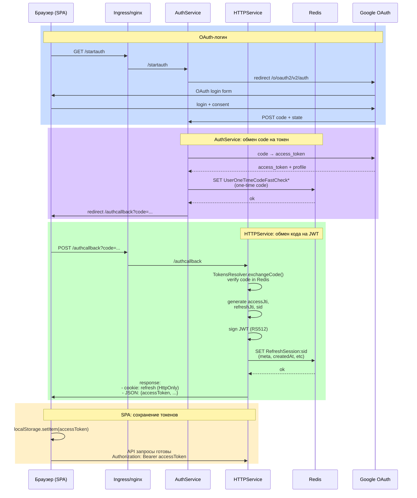
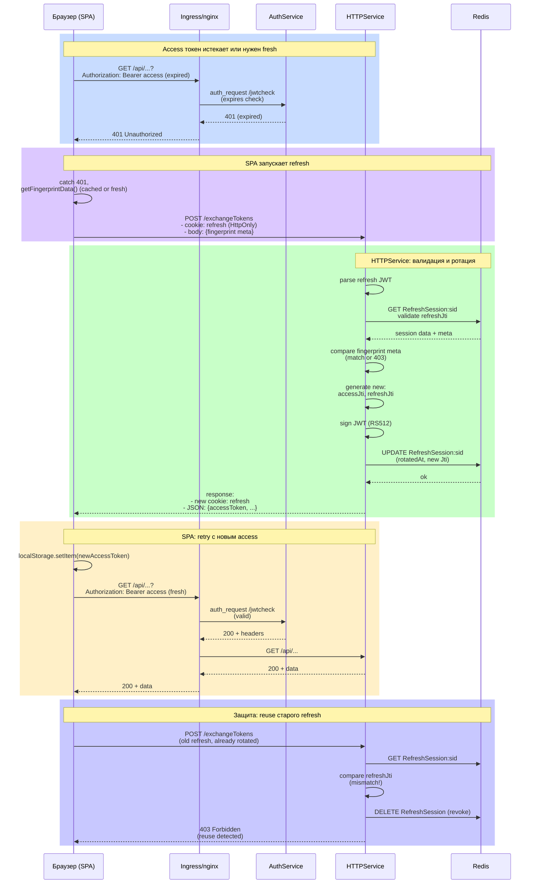

# Security Flow (SPA: Access In Memory + Refresh Cookie + Fingerprint)

Этот документ описывает **текущий** security‑флоу для SPA (k8s/Helm/kind — единственный режим деплоя, docker‑compose-режима в проекте больше нет).

## 1) Общая идея
- **Access JWT** короткий и используется для авторизации, но **не хранится в cookie**.
  - SPA хранит access **только в памяти (JS)** и отправляет его в `Authorization: Bearer <access>`.
- **Refresh JWT** длинный и используется только для обновления access, хранится в **HttpOnly cookie**.
- **Refresh‑сессия** хранится в Redis и привязана к fingerprint‑метаданным.
- **Единственная точка доверия для обычных HTTP API** — ingress/nginx: он валидирует access и выставляет заголовки; backend **не валидирует JWT сам**, а доверяет `X-User-ID`, `X-Authorities`, `X-Jti`, `X-Sid`.
  - **Исключение — WebSocket/STOMP** (раздел 11): SockJS‑хендшейк не несёт HTTP-заголовков, поэтому ingress не может его проверить через `auth_request`. Для этого пути backend **сам** валидирует access‑JWT (`AccessTokenVerifier`), в отличие от остальных HTTP API.

## 2) Где происходит проверка
- Ingress делает `auth_request` в `AuthService /jwtcheck`.
- auth_request передает `Authorization: Bearer <access>` в `jwtcheck` (cookie `access` больше не используется).
- Ingress:
  - **сбрасывает входящие** `X-User-ID`, `X-Authorities`, `X-Jti`;
  - **выставляет свои** после auth_request.
- Дополнительный defense-in-depth на уровне приложения: `MvcSecurityConfig` отдаёт голый **401** (не редирект на `/welcome`) для неаутентифицированных запросов к `/api/**`, если они всё же дошли до Spring — это нужно, чтобы SPA (fetch/XHR) видела 401 и запускала refresh, а не получала HTML-редирект.

## 3) Что кладем в токены
### Access JWT (короткий)
- `sub`, `jti`, `sid`, `authorities`, `exp`, `iat`, `iss`, `token_use=access`.

### Refresh JWT (длинный)
- `sub`, `jti` (refresh), `sid` (session id), `exp`, `iat`, `iss`, `token_use=refresh`.

## 4) Redis-структуры
- `RefreshSession:<sid>` → JSON:
  - `sub`, `sid`, `refreshJti`, `accessJti`,
  - `meta` (fingerprint), `createdAt`, `lastSeenAt`, `rotatedAt`, `status`.
- `user:` → set ключей refresh‑сессий (для массового revoke).

## 5) Логин / первичная выдача токенов
1) OAuth‑логин в `AuthService`.
2) `HTTPService` получает `sub/role`, создает:
   - `accessJti`, `refreshJti`, `sid`,
   - access‑JWT + refresh‑JWT.
3) Создается `RefreshSession:<sid>`.
4) Клиент получает:
   - `refresh` как **HttpOnly cookie**
   - `accessToken` в **JSON** (клиент кладет его в память)

### Диаграмма auth‑flow

## 6) Проверка запросов (API)
1) SPA делает запросы к backend и прикладывает `Authorization: Bearer <access>`.
2) Ingress/nginx делает `auth_request` → `/jwtcheck`.
3) `jwtcheck` валидирует access:
   - если токен валиден и `RefreshSession:<sid>` существует → отдаёт `X-User-ID`, `X-Authorities`, `X-Jti`, `X-Sid` (200).
   - если токен отсутствует/истек/битый → отдаёт **401**.
   - если refresh‑сессии нет → тоже **401** (моментальный logout).
4) На 401 SPA запускает refresh‑флоу и повторяет исходный запрос 1 раз.

## 7) Refresh‑флоу
1) SPA получает fingerprint/meta (с кешированием на фронте).
2) SPA вызывает `POST /exchangeTokens`, который получает:
   - refresh cookie,
   - fingerprint мету.
3) Backend валидирует refresh JWT:
   - сверяет `sid` и `refreshJti` с Redis,
   - сравнивает fingerprint мету.
4) Ротация:
   - новый `refreshJti` + новый `accessJti`,
   - обновление `RefreshSession`.
5) Клиент получает:
   - новый `refresh` cookie
   - новый `accessToken` в JSON
6) Если refresh‑cookie отсутствует или сессия невалидна → 401/403, удаление refresh cookie и ре‑логин.

### Диаграмма refresh‑flow (ротация токенов)

## 8) Ошибки и защита
- **Refresh reuse** (старый refresh после ротации) → 403 и удаление сессии.
- **Нет refresh‑сессии** → 403/401 и редирект на login.
- **FP mismatch** → 403, чистка сессии, re‑login.

## 9) Кеширование fingerprint на фронте
- `meta_catcher.js` кеширует fingerprint/meta в `localStorage` (TTL ~ 24ч).
- Если кеш свежий, `getFingerprintData()` возвращает его без повторного сбора.
- Это уменьшает лишние вызовы FP‑скрипта и IP‑API.

## 10) Навигация страниц (важно для SPA)
- Браузер **не прикладывает** `Authorization` при обычной навигации по ссылкам (`window.location.href = ...`).
- Поэтому HTML страницы должны быть **public shell**, а данные должны грузиться через API (например, `/api/*`) с `Authorization`.

## 11) WebSocket / STOMP аутентификация
- SockJS/WebSocket‑хендшейк браузера **не несёт** `Authorization`‑заголовок, поэтому ingress **не** проверяет WS через `auth_request`. Хендшейк‑эндпоинты публичны.
- Аутентификация переехала на уровень приложения: клиент передаёт `Authorization: Bearer <access>` в **STOMP CONNECT**‑заголовках (`chatlist.js`, `index.js`).
- Сервер (`StompAuthChannelInterceptor` + `AccessTokenVerifier`) валидирует access‑JWT по `JWT_PUBLIC_KEY_PEM` на CONNECT и:
  - отклоняет CONNECT без валидного токена;
  - требует аутентифицированную сессию на SUBSCRIBE/SEND;
  - для **пер‑юзерных** назначений (все `/private/**`, а также `/mutual/chatlist/change_chatpreview/{id}`, `/mutual/chatlist/list_update/{id}`, `/mutual/chatlist/notify/{id}`) требует, чтобы хвост `/{userId}` совпадал с аутентифицированным пользователем.
  - общие каналы (typing‑статусы, image‑каналы, чат‑скоуп по `chat_id`) остаются широковещательными.
- Access‑токен валидируется один раз на CONNECT; при истечении токена нужен реконнект с новым access.

## 12) Быстрый чеклист
- Логин: `refresh` cookie + `accessToken` в JSON.
- Любой API запрос: `Authorization: Bearer <access>`.
- 401: refresh (`/exchangeTokens`) → новый `accessToken` → retry 1 раз.
- Нет refresh или FP mismatch: `/welcome` (login).
- WebSocket: `Authorization: Bearer <access>` в STOMP CONNECT; пер‑юзерные подписки только на свой `userId`.
